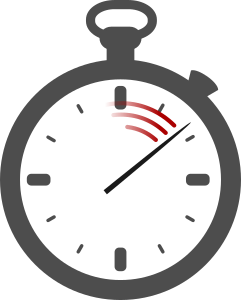

#  timeTrack - A time tracking commandline app
Time is money, right? A few things that aims to help tracking your time. 

[](https://www.npmjs.org/package/time-track)
[](https://travis-ci.org/s-a/time-track)
[](https://coveralls.io/github/s-a/time-track?branch=master)
[](https://www.codacy.com/app/stephanahlf/time-track)
[](https://david-dm.org/s-a/time-track)
[](https://david-dm.org/s-a/time-track#info=devDependencies)
[](https://www.npmjs.org/package/time-track)
[](/LICENSE.md#mit)
[](http://s-a.github.io/donate/)


## Installation
```npm install time-track -g```

## Demo


## Usage

```
 Usage: tt|time-track [options]

  Options:

    -h, --help                        output usage information
    -V, --version                     output the version number
    -l, --list                        list available projects
    -s, --switch [project]            create or switch to a given project name
    -i, --info [date]                 check the tracked time today or by a given date DD.MM.YYYY
    -S, --availableseconds [seconds]  set the available time for the current project in seconds
    -M, --availableminutes [minutes]  set the available time for the current project in minutes
    -H, --availablehours [hours]      set the available time for the current project in hours
    -D, --availabledays [days]        set the available time for the current project in days
    -o, --open                        open the app data folder
    -O, --opensystem                  open the system data folder
    -e, --edit                        open current project data storage json file in your editor
    -E, --editsystem                  open system data storage json file in your editor
    -r, --report [reporter]           reports tracked with a given reporter (reportername is optional and defaults to default-reporter.js)
    -t, --timerange [MM.YYYY]         optional timerange for the reporter
```

## Write your own reporter
Currently the default reporter log csv data to console. ```tt -r > myreport.csv``` will write a csv file down to filesystem.  
Check out the [default reporter](/lib/default-reporter.js) and create your own. Then use it with ```tt -r my-custom-reporter.js```.

## Available time of a project per month
Internaly measured in seconds a few reportings in timeTrack may need this information. You can set available time using the ```--available*``` parms. ***Keep in mind that this sets currently the available time of the current active project and the current month.*** If you want to change available time of another month then use --o to open the AppData folder and edit the ```.json``` files manualy.